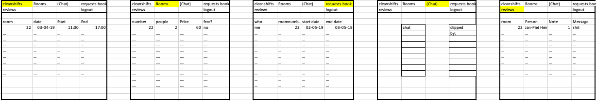

Nieuw Django format maken.
Bijhouden van Data voor een hotel.

Aan de hand van tabel Users kunnen alle bezoekers van de site opgedeeld worden in 3 groepen:

| Groep         | kamernummer     | staff?        |
|:------------- |:---------------:| -------------:|
| 1.            | Null            |          True |
| 2.            | not Null        |         False |
| 3.            | Null            |         False |

Tabel: Rooms, waar alle kamers gedefinieerd zijn.

Details Rooms:

1. Kamernumme, ForeignKey;
2. Aantal personen;
3. Prijs;

Als de lijst weergeven wordt, kun je die sorteren op max prijs, datum en aantal personen die er in die kamer kunnen.

Als er op een kamer gedrukt wordt, worden alle data weergeven wanneer deze kamer nog beschikbaar is. Er kan een request gestuurd worden om de kamer te huren. Ook wordt hierbij neergezet hoe laat iemand waarschijnlijk aankomt.

Tabel: Bookings, maken voor het bijhouden wie er welke kamer heeft gehuurd.

Details Bookings:

1. ID, ForeignKey;
2. Naam;
3. Start_date
4. End_date
5. arrival_date
6. arrival_time
7. Wachtwoord;
8. Kamernummer;

Er komt een pagina waar je je mening kan geven. Je kan je mening zowel annoniem, als met je naam erbij neerzetten. Ook het kamernummer komt erbij, zodat daar naar gekeken kan worden als er bijvoorbeeld meerdere slechte feedbacks komen vanuit dezelfde kamer. Tabel: Reviews is meningen tabel. Cijfer kunnen aangegeven worden door sterren aan te klikken en er kan een mening getyped worden. dit is niet meer te zien als deze persoon al een review heeft geplaatst. Dan zijn alleen alle reviews te zien. Groep1 en Groep3 kunnen ook alleen de reviwes zien. Staff is de enige die het kamernummer erbij ziet.

Details Reviews:

1. ID, ForeignKey;
1. Naam;
2. kamernummer;
3. cijfer;
4. mening;

Tabel: Cleanshifts, is waar roomcleaning voorbij komt. hier kun je een datum voor prikken wanneer jij er niet bent. Als ze niks opgeven voor een aantal dagen moet daar naar gevraagd worden en moet er dus een melding komen als er een kamer is waar wel mensen zijn, maar geen schoonmaak momenten.

Details Cleanshifts:

1. Kamernunmmer;
2. datum;
3. tijd;

Online chat maken met socket.io, waar mensen met elkaar kunnen praten en staff berichten kunnen clippen. Persoon3 kan hier niet bij. De tabel: Chat onthoudt alle berichten die zijn verstuurd en een tabel die de vast gezette berichten onthoudt voor de staff. De staff kan een bericht vast zetten in een andere kolom door op het bericht te tikken, zo kunnen ze ook het bericht verwijderen door op het bericht te klikken in de lijst met vast gezette berichten.

Details Chat:

1. ID, ForeignKey;
2. Naam;
3. kamernummer;
4. message;
5. time;

Details Clipped:

1. ID, ForeignKey;
2. naam_staff;
3. Naam_user;
4. kamernummer;
5. message;
6. time;

Dit zijn alle html pagina's die de staff kan zien. de geel gevinkde vakken, geven aan waar je bent volgens de navigate-bar. Alle blauwe vakken zijn subit knoppen, waar de persoon in een bepaalde groep iets aan een tabel kunnen toevoegen.

Dit zijn alle html pagina's die de Groep2 kan zien.

En tot slot alle pagina's waar Groep3 bij kan komen.

API:

Kalender: https://developers.google.com/calendar/overview
