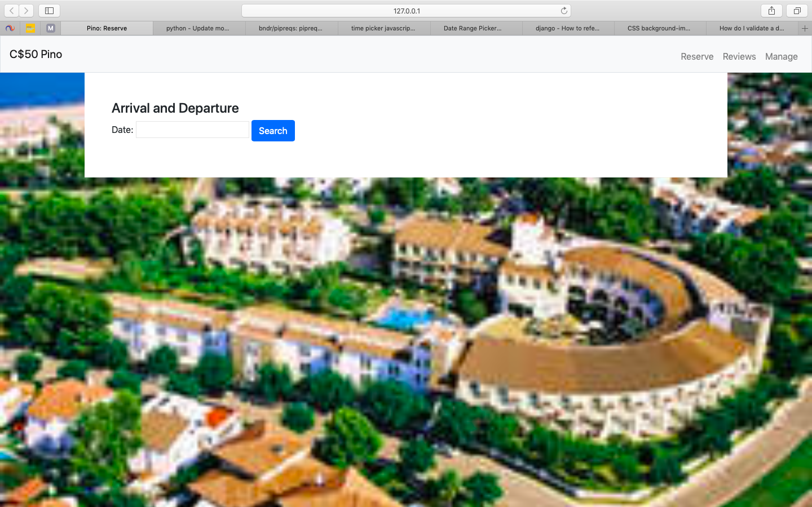
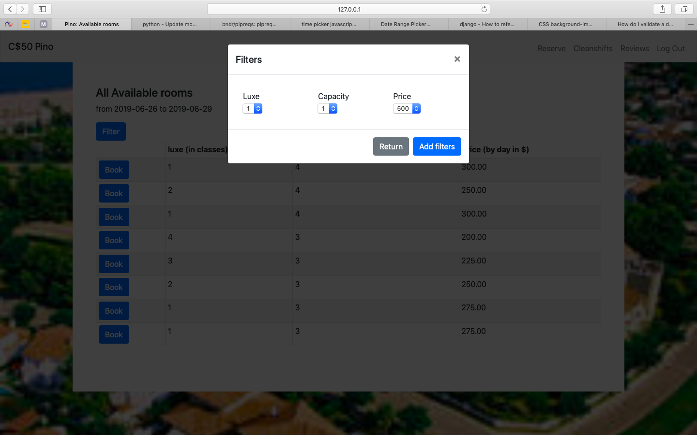
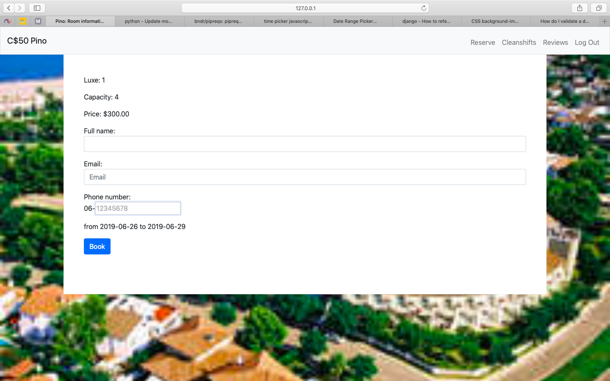
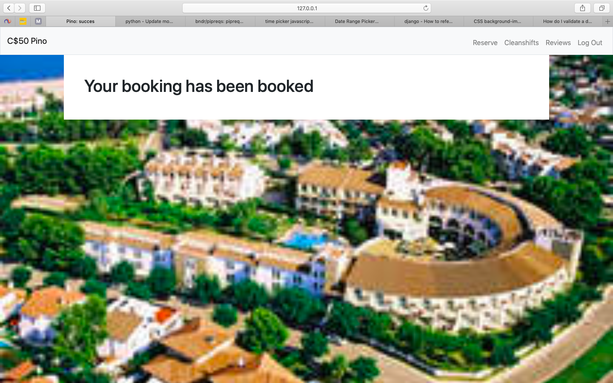
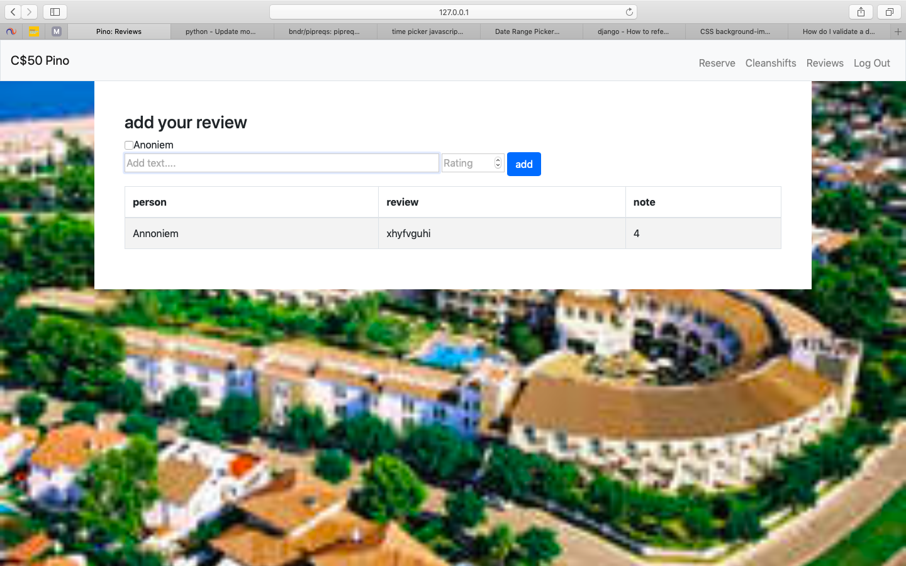
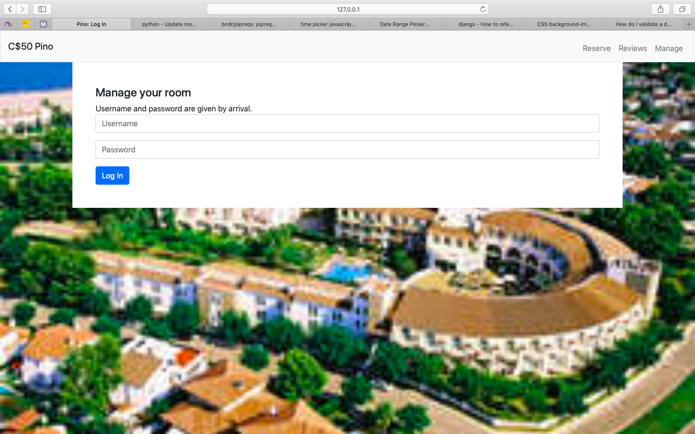
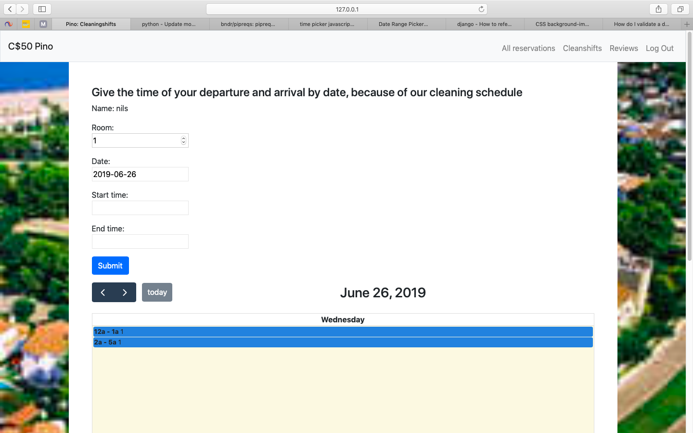
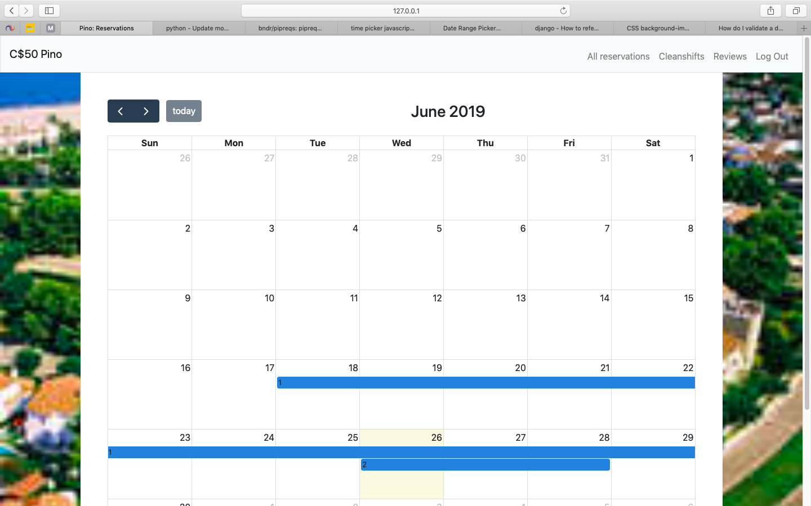

# Eindproject Pino Alto
Door: Nils van Doorn
filmpje: https://www.youtube.com/watch?v=zyJebF2MnCc

Er zijn 3 verschillende personen waar onderscheid in gemaakt wordt.

1. staff (superuser);
2. bezoekers;
3. buitenstaanders.

Buitenstaanders kunnen 2 dingen doen:

1. boeken;
2. reviews bekijken.

Bezoekers kunnen iets meer:

1. kunnen een cleaningshift toevoegen ;
2. een review toeveogen.

Staff:

1. geen reservering doen;
2. wel een cleaningshift toevoegen;
3. zien op een kalender welke kamers er zijn geboekt.

Als iemand het programma start, begin je op de pagina rerserve:

Hier kunnen de begin - en eind datum gegeven worden wanneer hij/zij een kamer wil reserveren. Als dit gedaan is, kom je op de volgende pagina:

Hier staan alle kamers die op het moment nog vrij zijn om de datum die je hiervoor hebt ingegeven. Je kan deze lijst nog aan je eigen eisen laten voldoen door op de filter knop te drukken. Hier is de mogelijkheid om de tabel te verkleinen aan de hand van luxe, capaciteit en prijs.

Als je op de knop links van de kamer klikt kom je op de volgende pagina:

Hier kun je de laatste gegevens opgeven om de kamer te boeken, als er daarna betaald is wordt komt er de volgende pagina in beeld:

dit betekend dat de boeking volledig gelukt en verwerkt is.

Er is dus een knop op naar de pagina met reviews toe te gaan.

Hier kan dus alleen een bezoeker eenmalig een review met cijfer toevoegen. Iederen kan wel ten alle tijden alle reviews bekijken.

De staff medewerkers en bezoekers kunnen inloggen. De bezoekers krijgen hun gebruikersnaam en wachtwoord bij binnenkomst van het hotel.

Als je ben ingelogd kan er op deze pagina een cleaningshift worden toegevoegd. Hier worden alle tijden verzameld dat de kamer leeg is terwijl het wel gereserveerd is. Uit deze gegevens kan later een schema gemaakt worden voor de schoonmaakdienst. De bezoeker ziet alle shifts van zijn eigen kamer op de kalender. De staff medewerkers zien alle shifts die verstuurd zijn.

De staff medewerkers kunnen als enige een maandkalender zien waar alle kamers op staan die gereserveerd zijn.

API-lijst:

1. datum kiezen:
	1. http://www.daterangepicker.com
	2. license: The MIT License (MIT)
2. tijd kiezen:
	1. https://weareoutman.github.io/clockpicker/
	2. license: The MIT License (MIT)
3. maand en dag kalender:
	1. https://fullcalendar.io
	2. license: The MIT License (MIT)
4. mollie betalingsverzoek:
	1. https://www.mollie.com/nl/
	2. license: The MIT License (MIT)
5. dateranges overlap
	1. https://stackoverflow.com/questions/9044084/efficient-date-range-overlap-calculation-in-python
