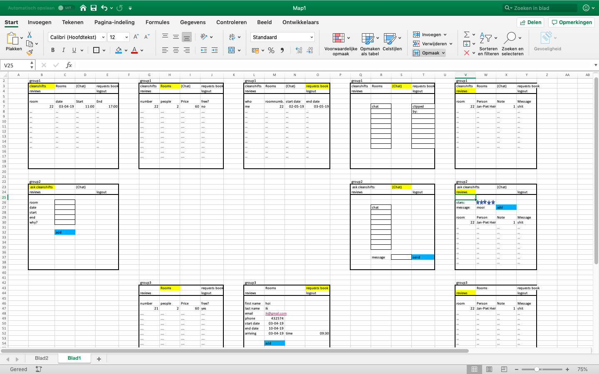

# eind-project

Nieuw Django format maken.
Bijhouden van Data voor een hotel.
Tabel1 waar alle kamers gedefinieerd zijn.

Tabel2 heeft alle kamers in zich met de data waar ze bezet zijn.

Als de lijst weergeven wordt, kun je die sorteren op max prijs, datum en aantal personen die er in die kamer kunnen.

Als er op een kamer gedrukt wordt, worden alle data weergeven wanneer deze kamer nog beschikbaar is. Er kan een request gestuurd worden om de kamer te huren. Ook wordt hierbij neergezet hoe laat iemand waarschijnlijk aankomt. 

Tabel3 maken voor het bijhouden wie er welke kamer heeft gehuurd.

Aan de hand van Users kunnen alle bezoekers van de site opgedeeld worden in 3 groepen:

| Groep         | kamernummer     | staff?        |
|:------------- |:---------------:| -------------:|
| 1.            | Null            |          True |
| 2.            | not Null        |         False |
| 3.            | Null            |         False |

De 3e groep hoeft zich alleen aan te melden. Deze hoeft alleen een gebruikersnaam opgeven om een kamer te kunnen huren.

Er komt een pagina waar je je mening kan geven. Je kan je mening zowel annoniem, als met je naam erbij neerzetten. Ook het kamernummer komt erbij, zodat daar naar gekeken kan worden als er bijvoorbeeld meerdere slechte feedbacks komen vanuit dezelfde kamer. Tabel4 is meningen tabel. Cijfer kunnen aangegeven worden door sterren aan te klikken en er kan een mening getyped worden. dit is niet meer te zien als deze persoon al een review heeft geplaatst. Dan zijn alleen alle reviews te zien. Staff en groep kunnen ook alleen de reviwes zien. Staff is de enige die het kamernummer erbij ziet.

Tabel5 is waar roomcleaning voorbij komt. hier kun je een datum voor prikken wanneer jij er niet bent. Als ze niks opgeven voor een aantal dagen moet daar naar gevraagd worden en moet er dus een melding komen als er een kamer is waar wel mensen zijn, maar geen schoonmaak momenten.

Online chat maken met socket.io, waar mensen met elkaar kunnen praten en staff berichten kunnen clippen. Persoon3 kan hier niet bij.

