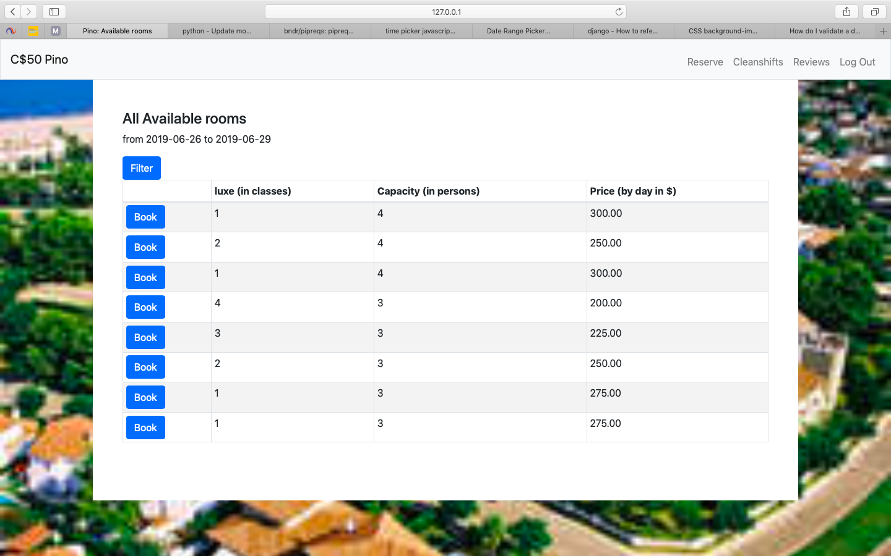

# Eindrapport
Het programma is gemaakt voor hotels of andere bedrijven die huizen verhuren. Op de foto is een lijst te zien nadat iemand de begin- en einddatum heeft opgegeven op het beginblad. In de lijst staan alle kamers die vrij zijn aan de hand van de gegeven data. Ook kunnen er reviews en cleaningshifts toegevoegd worden door bezoekers en staff medewerkers.

Er zijn 4 verschillende modellen verspreid over de over 8 html pagina's. 

1. Rooms
2. Booked
3. Reviews
4. Cleaningshifts

Rooms wordt alleen gebruikt in het screenshot hierboven. Alle kamers worden gepakt. Aan de hand van het model Booked worden de kamers eruit gehaald die overlap hebben met de data die gegeven is op de pagina waar je terecht komt als je het programma start. Deze data kunnen worden gekozen op een agenda die gemaakt is met behulp van http://www.daterangepicker.com. Als je op filter klikt kun je de tabel inkorten door minimum van luxe, minimale capaciteit en maximum van prijs aan te geven. Als er daarna op de knop Book geklikt word, moeten er nog een aantal persoonlijke gegevens ingevuld worden en aan de betaling voldoen worden. De betaling wordt geregeld via mollie, deze is gemaakt met hulp van https://www.mollie.com/nl/.

Booked wordt ook nog gebruikt om de kalender in te vullen met alle boekingen. Deze pagina is alleen te zien door de staff medewerkers. De kalender is gemaakt met https://fullcalendar.io. 

De model Reviews is alleen gebruikt op de pagina reviews. Deze pagina kan iedereen alle reviews doorkijken. Alleen bezoekers van het hotel kunnen eenmalig een bericht en cijfer toevoegen aan de lijst. De bezoeker heeft de mogelijkheid om zijn/haar review annoniem te laten vertonen. 

De cleaningshifts zijn er voor het hotel om een schema te maken voor de schoonmaakdienst. Alle bezoekers en staff medewerkers kunnen een datum, begin- en eindtijd toevoegen. Bezoekers krijgen een dagkalender te zien met alle schoonmaaktijden die op hun kamer staat. De staff zie in hun dagkalender alle tijden waar de schoonmaakdienst binnen mag komen. De tijden kunnen gekozen worden door op een klok te klikken, deze klok is gemaakt met behulp van https://weareoutman.github.io/clockpicker/. 

De volgende veranderingen heb ik geplaats voor meer gebruiksvriendelijkheid. 

1. Eerst om de aankomst en vertrek datum vragen, daarna de mogelijkheid pas geven om de luxe capaciteit en prijs te weergeven. Anders had iemand eerst op kamerinformatie moeten klikken om te zien of dat de kamer nog vrij was.
2. datepicker
3. clockpicker
4. fullcalendar

Mollie hoorde ik pas later, maar was een mooie toevoeging aan het programma. Het ziet er met mollie echter uit als iemand een kamer wil boeken.

De twee onderwerpen die niet gelukt zijn de sterren om een cijfer aan te geven bij reviews en de online chat. Beide zijn geen tijd voor vrij gemaakt doordat er andere toevoegingen (bijvoorbeel mollie en fullcalendar) meer prioriteit hadden. Vooral fullcalendar is iets dat een stuk relevanter is dan een online chat. Voor de relevantie geldt ook dat datepicker en clockpicker veel gebruiksvriendelijker zijn.

Als ik meer tijd had gehad, zou ik de sterren maken op een cijfer te geven aan het hotel. Dit staat een stuk mooier dan letterlijk een cijfer in te vullen. Waarschijnlijk was het ook makkelijker geweest om te controleren of iemand een valide review heeft gegeven.